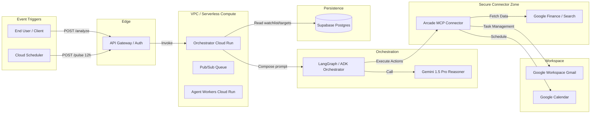

# The Artha-Agent 🚀
### *An Autonomous AI Executive Assistant for Proactive Investment Management*

The Artha-Agent is an agentic workflow built on Google Cloud that transforms investment monitoring from a reactive chore into a proactive executive experience. Leveraging **Gemini 1.5 Pro** and the **Arcade MCP**, Artha-Agent autonomously monitors market conditions, analyzes them against personalized user strategies, and manages professional communication and scheduling via Google Workspace.

---

## 🌟 Key Features

* **Proactive 12-Hour Pulse:** Automated portfolio scanning powered by Google Cloud Scheduler.
* **Executive Action Briefs:** Context-aware investment summaries delivered directly to your Gmail inbox.
* **Ad-hoc Deep Dives:** Real-time, on-demand analysis for global tickers via a FastAPI interface.
* **Smart Scheduling:** Automated Google Calendar management for critical trade reviews and decision-making.
* **Personalized Strategy Layer:** Grounded reasoning based on user-defined target prices and investment goals stored in Supabase.

---

## 🏗️ Architecture

The system utilizes a decoupled architecture to ensure scalability and security.



---

## 🛠️ Technology Stack

* **Core Reasoning:** Gemini 1.5 Pro (via Google AI SDK)
* **Orchestration:** LangGraph (Stateful Agentic Workflows)
* **Tooling Bridge:** Arcade MCP (Secure Connector for Google Workspace & Finance)
* **Infrastructure:** Google Cloud Run (Compute) & Google Cloud Scheduler (Automation)
* **Database:** Supabase (Persistent User Context & Watchlist Memory)
* **API Framework:** FastAPI

---

## 🚀 Getting Started

### 1. Prerequisites
* Python 3.12+
* Google Cloud Project with Cloud Run & Scheduler enabled.
* Arcade API Key ([cloud.arcade.dev](https://cloud.arcade.dev))
* Supabase Project URL and Anon Key.

### 2. Installation
```bash
# Clone the repository
git clone https://github.com/amarv0225/artha-agent.git
cd artha-agent

# Set up virtual environment
python3 -m venv .venv
source .venv/bin/activate

# Install dependencies
pip install -r requirements.txt
```

### 3. Environment Variables
Create a `.env` file or export the following variables:
```bash
export ARCADE_API_KEY="your_arcade_key"
export SUPABASE_URL="your_supabase_url"
export SUPABASE_KEY="your_supabase_key"
export GOOGLE_CLOUD_PROJECT="adk-mcp-491712"
```

---

## 📡 Deployment

### Deploy to Cloud Run
```bash
gcloud run deploy artha-agent \
    --source . \
    --region us-central1 \
    --allow-unauthenticated \
    --set-env-vars "ARCADE_API_KEY=$ARCADE_API_KEY,SUPABASE_URL=$SUPABASE_URL,SUPABASE_KEY=$SUPABASE_KEY,GOOGLE_CLOUD_PROJECT=$GOOGLE_CLOUD_PROJECT"
```

### Configure the 12-Hour Pulse
```bash
gcloud scheduler jobs create http artha-proactive-pulse \
    --schedule="0 */12 * * *" \
    --uri="https://YOUR-SERVICE-URL/v1/pulse" \
    --http-method=POST \
    --oidc-service-account-email="337407073347-compute@developer.gserviceaccount.com" \
    --location=us-central1
```

---

## 📖 API Usage

### Ad-hoc Analysis
**Endpoint:** `POST /v1/analyze`
**Body:**
```json
{
  "ticker": "HDFCBANK.NS"
}
```

### Manual Pulse Trigger
**Endpoint:** `POST /v1/pulse`
*(Scans the entire Supabase watchlist and triggers Gmail/Calendar actions for BUY/SELL signals)*

---

## 🛡️ License
Distributed under the MIT License. See `LICENSE` for more information.
